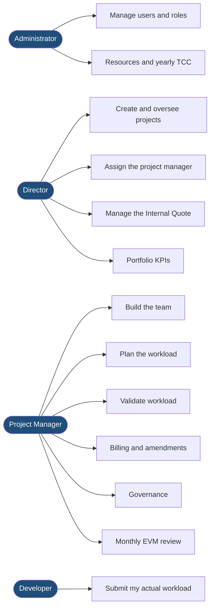
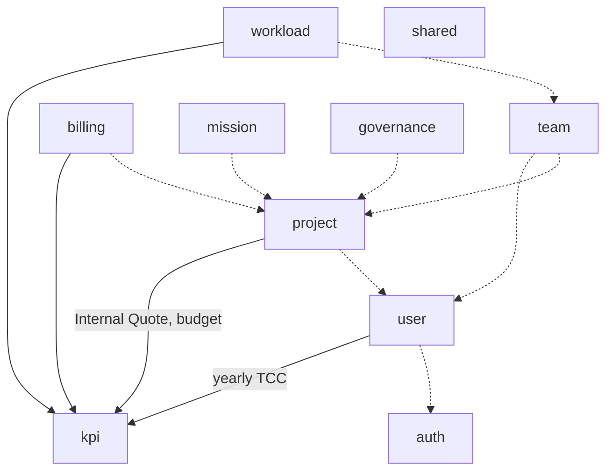
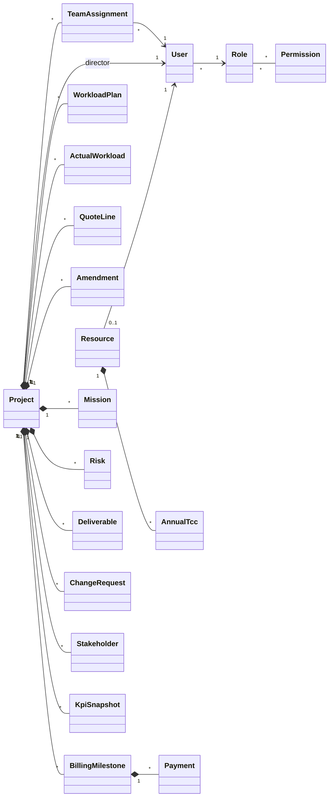
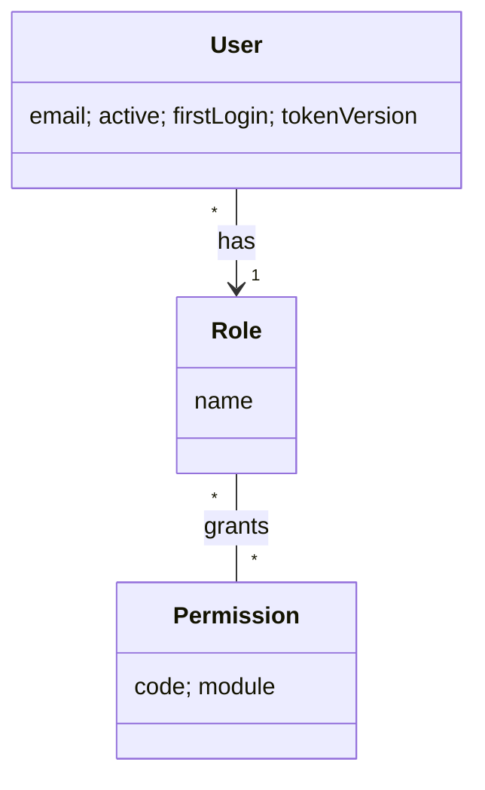
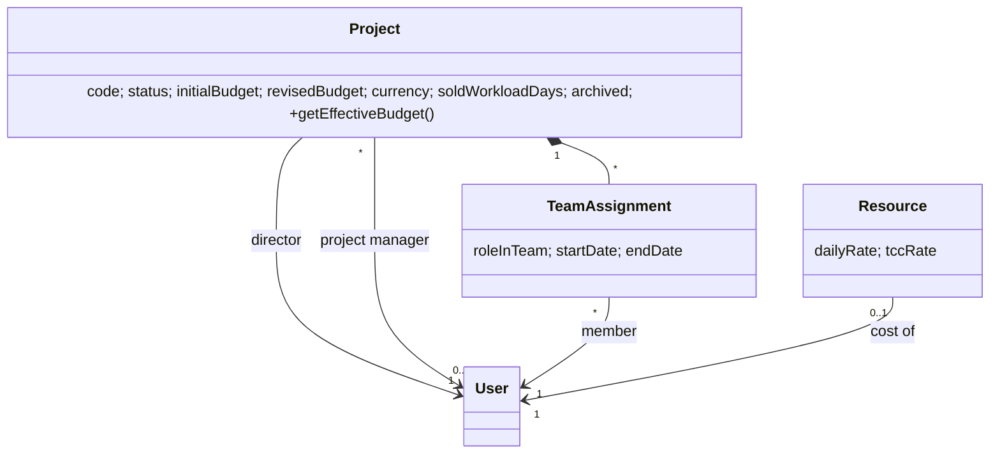
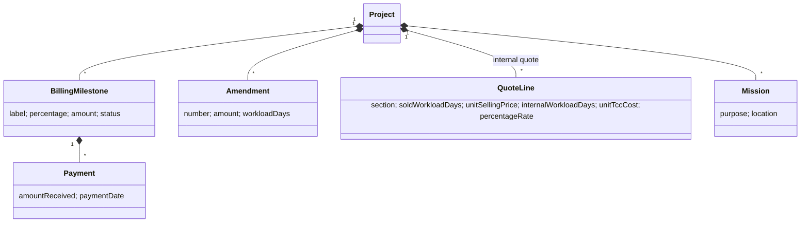
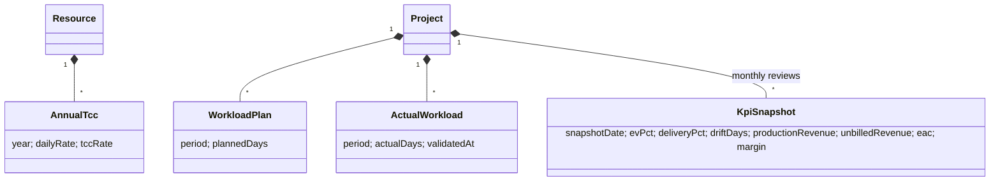
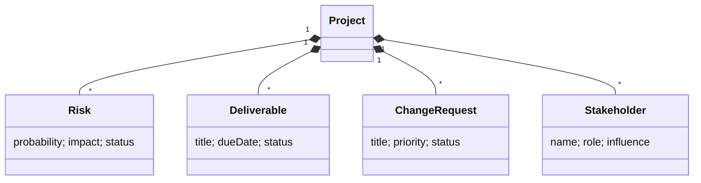
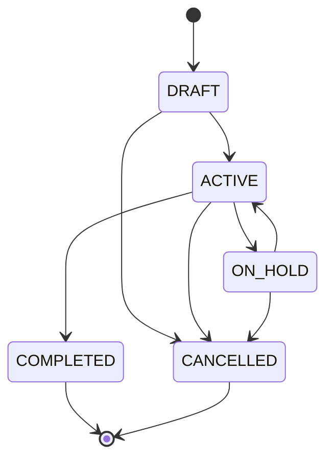

# UML DESIGN — PMS

**Project:** Centralized platform for managing and financially steering IT projects (PMS)
**Version:** 2.1 — English pass, 2026-08 · supersedes v2.0 (2026-07-05, Chief Software Architect) which superseded the 2026-06-25 version
**Tooling (ADR-023):** PlantUML = source of truth (`docs/uml/*.puml`); Mermaid = readable mirror below.
**Two-level policy (ADR-024):** Level 1 (this document, 15 diagrams) = report; Level 2
(`docs/uml/engineering/`) = reference archive, not part of the report.

---

## 0. Why this redesign (v2.0, then the v2.1 English pass)

An audit on 2026-07-05 compared every v1 diagram against the code actually shipped. Findings:

1. **Fictional classes.** `ProjectManagerAssignment` never existed (the code carries a direct
   `Project.chefProjet` association); the old team-assignment class pointed at `Resource` when
   the code links `TeamAssignment` → `User` with `roleInTeam` and dates — no allocation rate field.
2. **Invented names.** Placeholder class names were used instead of the real `PlanCharge`,
   `ChargeReelle`, `TccAnnuel`/`Resource`. A jury opening the code found nothing matching.
3. **An imaginary pipeline.** The "workload → KPI recompute" sequence and the "hybrid recompute"
   activity described an asynchronous event bus that was never built. The real engine is simpler
   and more defensible: **read-time computation + a frozen monthly snapshot** (ADR-026).
4. **Two missing domains.** Governance (Risk, Deliverable, Change Request, Stakeholder) and the
   Internal Quote appeared nowhere.
5. **Missing views.** No state diagram (even though two state machines exist in the code) and no
   deployment diagram.

**Principles applied in v2:** one domain per diagram, one page per diagram, only real names from
the code, meaningful attributes only, no technical classes (Controller/Service/Repository/DTO/
Mapper), enums only when they carry business meaning (statuses), every diagram checked against
the entity file before rendering.
The project state machine, unguarded in the code at the time, was **implemented** as part of this
work (`ProjectStatus.canTransitionTo`, illegal transition → 422, tested): diagram 12 documents
real behavior, not an intention.

**v2.1 (2026-08):** the report will be published in English, so all report-level diagrams,
this document, and chapter 5 of the report were translated. Class names were given a
*conceptual* English label for the report (e.g. `BillingMilestone` for the real `JalonFacturation`,
`WorkloadPlan`/`ActualWorkload` for the real `PlanCharge`/`ChargeReelle`) — the mapping is
documented in `docs/uml/UML_AUDIT.md` so it stays traceable to the actual code. The Level 2
engineering diagrams (`docs/uml/engineering/`) were also audited and corrected in the same pass —
several had drifted from the real code (wrong enum values, wrong relationship targets, three
class names that didn't exist anywhere) — see `docs/uml/engineering/UML_AUDIT.md`.

---

## 1. Use Case Diagram
**Source:** [`01-use-case.puml`](uml/01-use-case.puml) · **Rendered:** `use_case.png`

4 actors, 15 use cases. v2 additions: Internal Quote (Director, restricted access), monthly EVM
review, governance, workload validation. The v1 "KIMAI" actor was removed: automatic import isn't
implemented (manual entry only) — it remains a documented future perspective. **v2.1 refinement:**
introduced actor generalization — an abstract *Platform User* (all four roles authenticate) and
*Portfolio User* (Director/PM/Developer all view KPIs, role-filtered) — replacing what were
previously repeated, redundant associations from every concrete actor to the same shared use case.

## 2. Package Diagram
**Source:** [`02-package.puml`](uml/02-package.puml) · **Rendered:** `package_diagram.png`

v2: the **10 real packages** of `com.pms.*` (v1 listed modules that didn't match the code:
TCC lives in `user`, "plan" and "actual" together form `workload`, `governance` was missing).

## 3. Class Diagrams (1 global view + 5 domains)

All omit audit fields (`BaseEntity`) and technical classes.

### 3.0 Domain overview — [`14-class-global.puml`](uml/14-class-global.puml) · `class_global.png`

**High-abstraction global map**: the real entities grouped into 7 sub-domains,
**relationships only, zero attributes** (`hide members`). This is the opening figure of the
design chapter: it shows at a glance that `Project` is the domain's aggregation root; each
sub-domain is then detailed by diagrams 3.1 to 3.5.

**Principle:** the global view deliberately sacrifices attributes to stay readable on one page —
it's the map, not the territory. The user links from `WorkloadPlan`/`ActualWorkload` are omitted
here (noted on the diagram) to avoid the spaghetti of crossing lines that made v1 unreadable;
they appear in the domain diagrams.

### 3.1 Security — [`03-class-security.puml`](uml/03-class-security.puml) · `class_security.png`

`tokenVersion` implements session revocation (ADR-017); the role→permission matrix lives in the
database (dynamic RBAC, proven by migrations V12/V20/V23).

### 3.2 Project & Team — [`04-class-project-team.puml`](uml/04-class-project-team.puml) · `class_project_team.png`

v2 corrections: removed the fictional `ProjectManagerAssignment`; `TeamAssignment` → `User`
(not `Resource`); real attributes. The revised budget has a single writer: the amendment (ADR-025).

### 3.3 Financial — [`05-class-financial.puml`](uml/05-class-financial.puml) · `class_financial.png`

v2 addition: `QuoteLine` (empty structure — amounts/margins always computed at read time, never
stored; see `BUSINESS_ANALYSIS.md`). Milestone statuses: `PLANNED → INVOICED → PAID`.

### 3.4 Workload & KPI — [`06-class-kpi.puml`](uml/06-class-kpi.puml) · `class_kpi.png`

v2 corrections: real names (`PlanCharge`/`ChargeReelle`/`TccAnnuel` in the code, shown here under
their report-level conceptual names), real EVM indicators (per F-AFF-13). The daily cost of a
man-day uses the rate for **the year the period falls in**.

### 3.5 Governance — [`07-class-governance.puml`](uml/07-class-governance.puml) · `class_governance.png`

The EVM engine's Delivery % is derived from deliverables (`DELIVERED`/`VALIDATED` ÷ planned).

## 4. Sequence Diagrams

### 4.1 Authentication — [`08-seq-login.puml`](uml/08-seq-login.puml) · `seq_login.png`
v2 adds what actually distinguishes the implementation: a constant-time rate limiter, a
single-use refresh token in an HttpOnly `SameSite=Strict` cookie, forced first-login enforced
server-side.

### 4.2 Assignment with scope — [`09-seq-assign-developer.puml`](uml/09-seq-assign-developer.puml) · `seq_assign_developer.png`
Shows the double check (the `ASSIGN_DEVELOPER` permission **and** scope via
`ProjectScopeService`, a single EXISTS query) — the heart of ADR-021.

### 4.3 Workload → hybrid KPI — [`10-seq-workload-kpi.puml`](uml/10-seq-workload-kpi.puml) · `seq_submit_workload.png`
v1 showed an event-driven asynchronous recompute that was **never built**. v2 documents the real
engine (ADR-026) in three steps: guarded entry (own workload + active team membership) → KPIs
**computed at read time** (nothing written) → **frozen snapshot** at the monthly review (EV %
entered by the PM).

## 5. Activity Diagram — [`11-act-project-lifecycle.puml`](uml/11-act-project-lifecycle.puml) · `act_project_lifecycle.png`
v2: actor swimlanes, adds the Internal Quote (Director), workload validation, and the monthly
review loop; ends with closure + archiving. The v1 "KPI recompute" activity was removed from
this diagram (fictional pipeline — see 4.3) and now lives as its own diagram (5.1 below).

### 5.1 Activity — KPI recomputation — [`15-act-kpi-recompute.puml`](uml/15-act-kpi-recompute.puml) · `act_kpi_recompute.png`
The real trigger-based flow: a business event (workload entry, milestone/mission/amendment
change) triggers recomputation of costs and indicators on the next read — no event bus, no
background job.

## 6. State Diagram — [`12-state-project.puml`](uml/12-state-project.puml) · `state_project.png`

**This diagram preceded a fix:** the audit found that `changeStatus` enforced no transition rule
at all. The state machine is now **enforced by the enum**
(`ProjectStatus.canTransitionTo`); an illegal transition → HTTP 422, covered by two tests.
Archiving is a flag on `COMPLETED`, not a state.

## 7. Deployment Diagram — [`13-deployment.puml`](uml/13-deployment.puml) · `deployment_diagram.png`
Three nodes: browser (static Angular 21 SPA) → Spring Boot 3.3 API (single JAR, modular
monolith) → PostgreSQL 17 (Flyway migrations at startup). JWT Bearer + HttpOnly refresh cookie
over HTTPS.

---

## 8. Summary — the 15 report diagrams

| # | Type | Source | Rendered | v2 status |
|---|------|--------|-------|-----------|
| 0 | Classes — Domain overview | `14-class-global.puml` | `class_global.png` | **New** (map: entities, relationships only) |
| 1 | Use case | `01-use-case.puml` | `use_case.png` | Updated (Internal Quote, review, governance; KIMAI removed) |
| 2 | Packages | `02-package.puml` | `package_diagram.png` | Redesigned (real packages) |
| 3 | Classes — Security | `03-class-security.puml` | `class_security.png` | Updated (tokenVersion) |
| 4 | Classes — Project & Team | `04-class-project-team.puml` | `class_project_team.png` | Fixed (fictional classes removed) |
| 5 | Classes — Financial | `05-class-financial.puml` | `class_financial.png` | Fixed + Internal Quote |
| 6 | Classes — Workload & KPI | `06-class-kpi.puml` | `class_kpi.png` | Fixed (real names, EVM) |
| 7 | Classes — Governance | `07-class-governance.puml` | `class_governance.png` | **New** |
| 8 | Sequence — Authentication | `08-seq-login.puml` | `seq_login.png` | Updated (refresh rotation) |
| 9 | Sequence — Assignment + scope | `09-seq-assign-developer.puml` | `seq_assign_developer.png` | Updated (ScopeService) |
| 10 | Sequence — Hybrid KPI | `10-seq-workload-kpi.puml` | `seq_submit_workload.png` | **Redesigned** (fictional pipeline → real one) |
| 11 | Activity — Lifecycle | `11-act-project-lifecycle.puml` | `act_project_lifecycle.png` | Updated (swimlanes) |
| 12 | States — Project status | `12-state-project.puml` | `state_project.png` | **New** (+ implemented guard) |
| 13 | Deployment | `13-deployment.puml` | `deployment_diagram.png` | **New** |
| 15 | Activity — KPI recompute | `15-act-kpi-recompute.puml` | `act_kpi_recompute.png` | **New** (2026-08 — source was missing though the render was already embedded in the report) |

Rendering: `java -jar plantuml.jar -tpng -charset UTF-8 docs/uml/*.puml`, or via Kroki (`docs/uml/*.puml` → `https://kroki.io/plantuml/png`).

**Two diagram types deliberately absent from this document:**
- **ERD** — the entity-relationship model lives in [`DATABASE_DESIGN.md`](DATABASE_DESIGN.md) §2
  (updated *as-built* on 2026-07-05, 22 real tables); duplicating it here would create two
  sources of truth.
- **Component diagram** — redundant with the package diagram for a modular monolith with a
  single deployable; the deployment diagram (13) covers the physical view.

## 9. Appendix — Engineering UML (Level 2, not part of the report)

`docs/uml/engineering/` was originally kept as an **archive of the initial design** (Phase 4).
It was audited and corrected in the same 2026-08 pass as this document — several diagrams had
drifted from the real code (see `docs/uml/engineering/UML_AUDIT.md` for specifics: three
nonexistent class names, a fabricated enum, two wrong relationship targets, all fixed and
re-verified against the entity source). Going forward it is a **detailed, implementation-exact
reference**, not the report's source of truth: if this document (v2) and the code ever disagree
again, **the code wins**, and this document should be corrected to match.

*End of UML design v2.1 — every diagram verified against the code; v2.0 verified 2026-07-05, v2.1 English pass and re-verification 2026-08.*
