# CONCEPTION UML — PMS

**Projet :** Plateforme centralisée de gestion et de pilotage financier des projets informatiques (PMS)
**Phase :** 4 — Conception UML · **Statut :** En attente de validation · **Date :** 2026-06-25
**Outillage (ADR-023) :** PlantUML = source de vérité ; Mermaid = miroir lisible.
**Politique deux-niveaux (ADR-024) :**
- **Niveau 1 — UML du rapport** (`docs/uml/`) : simple, pédagogique, lisible en 30 secondes,
  une page A4 maximum. **Seul ce niveau apparaît dans le rapport.**
- **Niveau 2 — UML d'ingénierie** (`docs/uml/engineering/`) : modèle complet et détaillé,
  pour référence/maintenance uniquement.

> **Règle de décision :** en cas de conflit entre exhaustivité et lisibilité, la lisibilité gagne.

---

## 1. Diagramme de cas d'utilisation (Niveau 1)
**Source :** [`docs/uml/01-use-case.puml`](uml/01-use-case.puml) · **Rendu :** `img/use_case.png`

4 acteurs (Administrateur, Directeur, Chef de Projet, Développeur) et 12 cas d'utilisation métier.

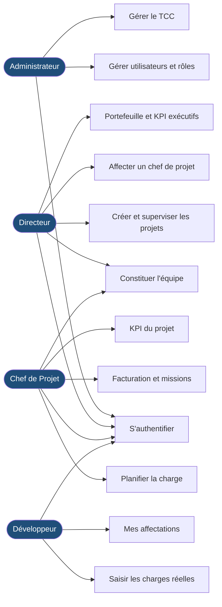

---

## 2. Diagramme de packages (Niveau 1)
**Source :** [`docs/uml/02-package.puml`](uml/02-package.puml) · **Rendu :** `img/package_diagram.png`

Les **10 modules fonctionnels** et leurs dépendances principales (les flèches du bas convergent
vers le moteur de KPI, qui agrège tout le reste).

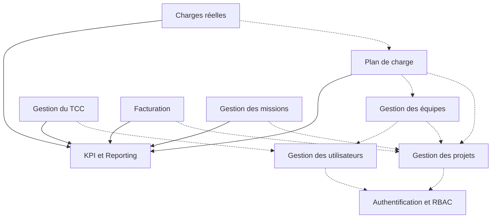

---

## 3. Diagrammes de classes (Niveau 1, 4 domaines)
Pour la lisibilité, le modèle est **éclaté en 4 diagrammes de domaine** (ADR-024). Tous omettent les
champs d'audit et les classes techniques (Controller/Service/Repository/DTO/Mapper).

### 3.1 Domaine Sécurité
**Source :** [`03-class-security.puml`](uml/03-class-security.puml) · **Rendu :** `img/class_security.png`

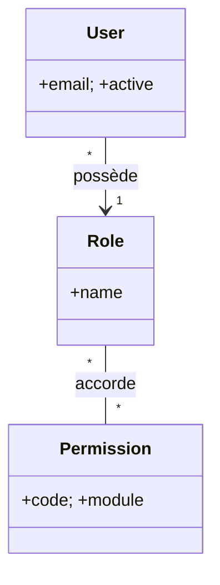

### 3.2 Domaine Projet & Équipe
**Source :** [`04-class-project-team.puml`](uml/04-class-project-team.puml) · **Rendu :** `img/class_project_team.png`

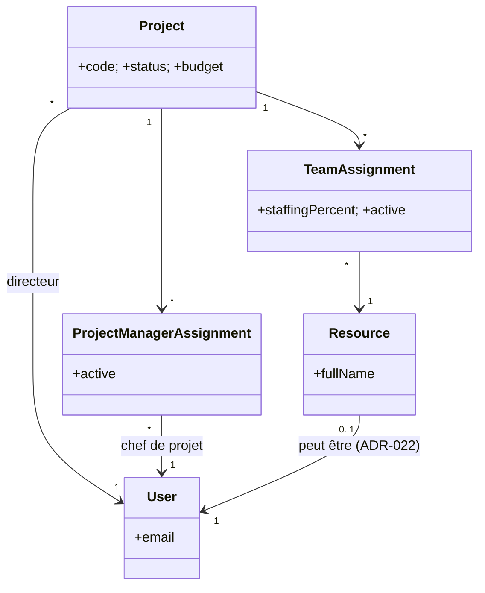

### 3.3 Domaine Financier
**Source :** [`05-class-financial.puml`](uml/05-class-financial.puml) · **Rendu :** `img/class_financial.png`

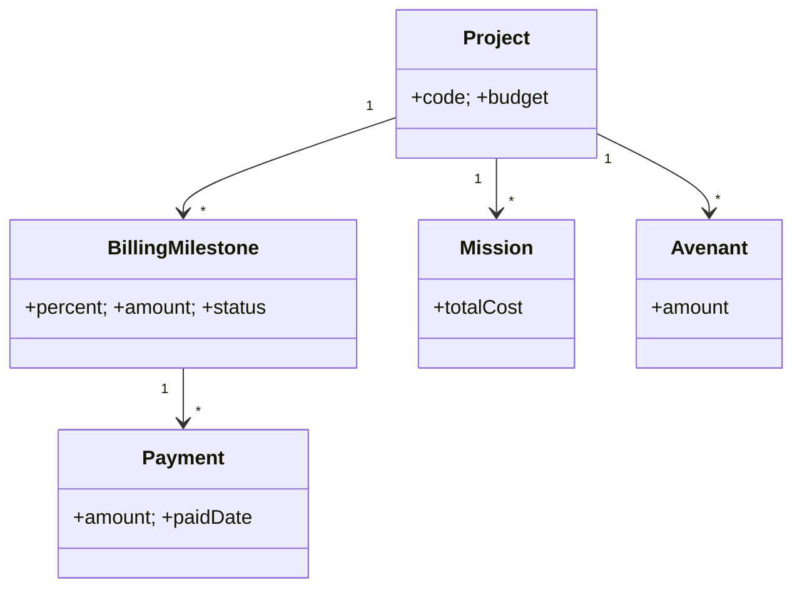

### 3.4 Domaine Charges & KPI
**Source :** [`06-class-kpi.puml`](uml/06-class-kpi.puml) · **Rendu :** `img/class_kpi.png`

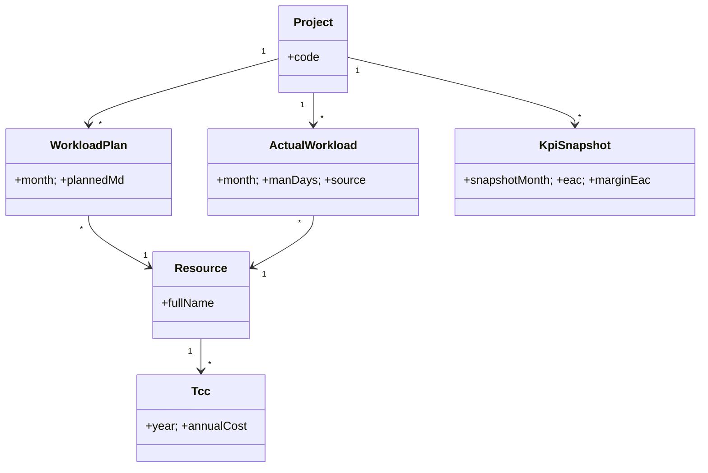

---

## 4. Diagrammes de séquence (Niveau 1)

### 4.1 Connexion
**Source :** [`07-seq-login.puml`](uml/07-seq-login.puml) · **Rendu :** `img/seq_login.png`

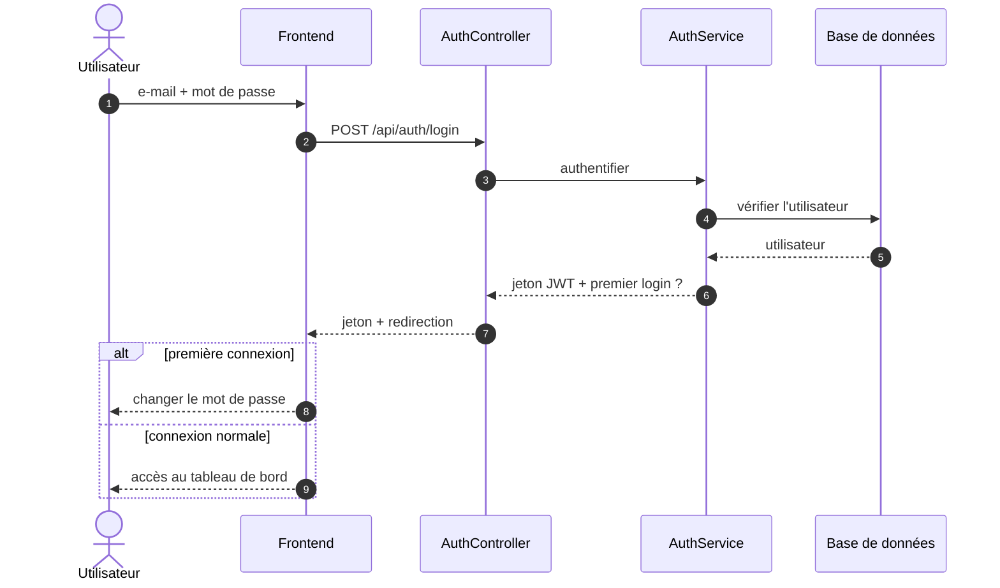

### 4.2 Affecter un développeur (permission ET portée)
**Source :** [`08-seq-assign-developer.puml`](uml/08-seq-assign-developer.puml) · **Rendu :** `img/seq_assign_developer.png`

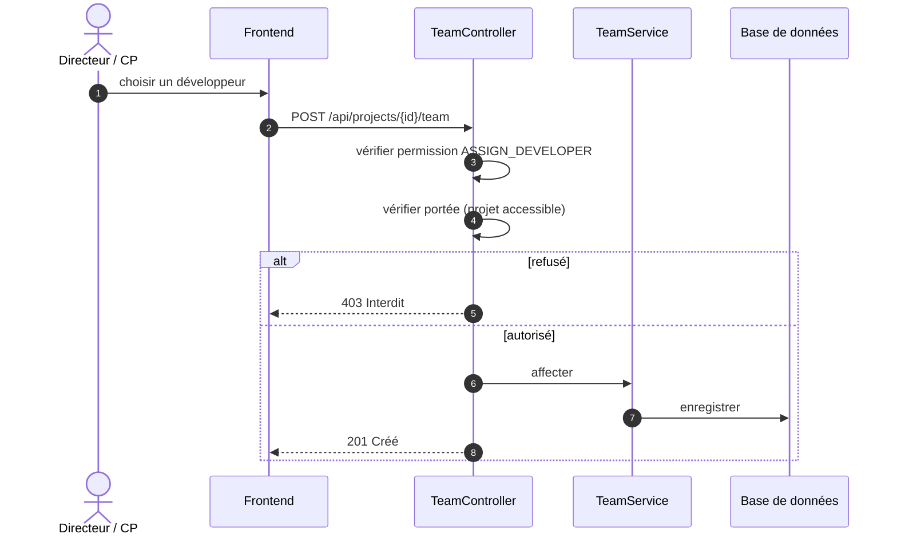

### 4.3 Saisir les charges → recalcul KPI
**Source :** [`09-seq-submit-workload-kpi.puml`](uml/09-seq-submit-workload-kpi.puml) · **Rendu :** `img/seq_submit_workload.png`

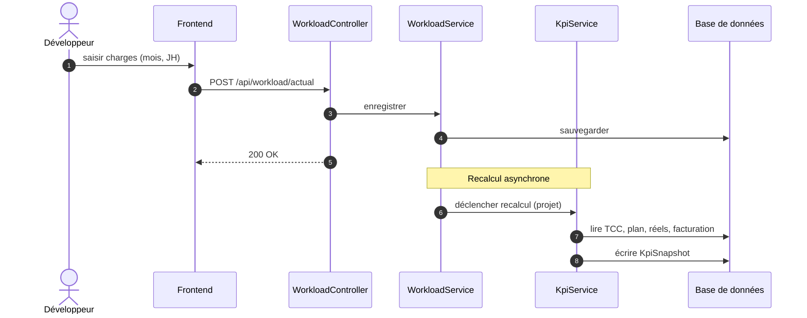

---

## 5. Diagrammes d'activité (Niveau 1)

### 5.1 Cycle de vie d'un projet
**Source :** [`10-act-project-lifecycle.puml`](uml/10-act-project-lifecycle.puml) · **Rendu :** `img/act_project_lifecycle.png`

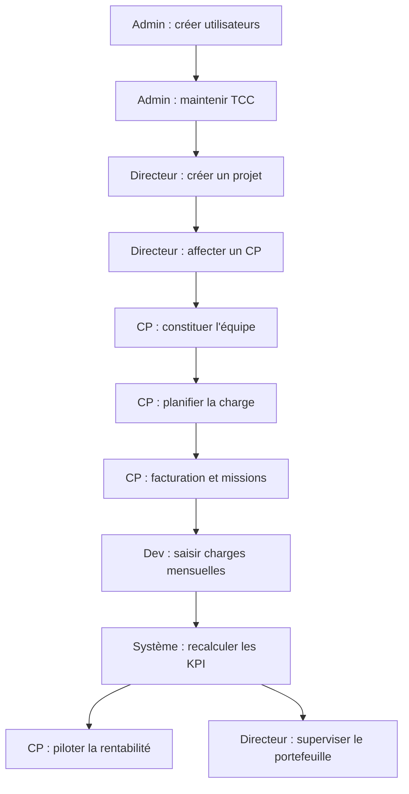

### 5.2 Recalcul hybride des KPI
**Source :** [`11-act-kpi-recompute.puml`](uml/11-act-kpi-recompute.puml) · **Rendu :** `img/act_kpi_recompute.png`

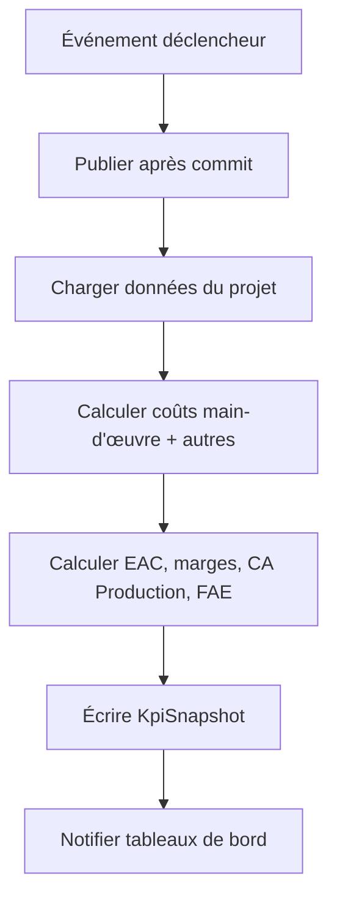

---

## 6. Synthèse — diagrammes Niveau 1 (rapport)

| # | Type | Source PlantUML | Rendu PNG |
|---|------|-----------------|-----------|
| 1 | Cas d'utilisation | `01-use-case.puml` | `img/use_case.png` |
| 2 | Packages (10 modules) | `02-package.puml` | `img/package_diagram.png` |
| 3 | Classes — Sécurité | `03-class-security.puml` | `img/class_security.png` |
| 4 | Classes — Projet & Équipe | `04-class-project-team.puml` | `img/class_project_team.png` |
| 5 | Classes — Financier | `05-class-financial.puml` | `img/class_financial.png` |
| 6 | Classes — Charges & KPI | `06-class-kpi.puml` | `img/class_kpi.png` |
| 7 | Séquence — Connexion | `07-seq-login.puml` | `img/seq_login.png` |
| 8 | Séquence — Affecter développeur | `08-seq-assign-developer.puml` | `img/seq_assign_developer.png` |
| 9 | Séquence — Charges → KPI | `09-seq-submit-workload-kpi.puml` | `img/seq_submit_workload.png` |
| 10 | Activité — Cycle de vie projet | `10-act-project-lifecycle.puml` | `img/act_project_lifecycle.png` |
| 11 | Activité — Recalcul KPI | `11-act-kpi-recompute.puml` | `img/act_kpi_recompute.png` |

---

## 7. Annexe — UML d'ingénierie (Niveau 2, hors rapport)

Les diagrammes détaillés (modèle de classes complet aligné sur `schema.sql`, séquences avec toutes
les interactions, contexte de sécurité, ScopeService, etc.) sont conservés sous
[`docs/uml/engineering/`](uml/engineering/) pour référence et maintenance. **Ils ne sont pas inclus
dans le rapport PFE** (ADR-024).

| Source d'ingénierie | Rendu | Objet |
|---|---|---|
| `engineering/01-use-case.puml` | `engineering/img/use_case.png` | 6 acteurs, ~17 cas d'utilisation détaillés |
| `engineering/02-class.puml` | `engineering/img/class_diagram.png` | Modèle complet (~26 classes + énumérations) |
| `engineering/03..05-seq-*.puml` | `engineering/img/seq_*.png` | Séquences détaillées (cache de sécurité, ScopeService, Bus d'événements) |
| `engineering/06..07-act-*.puml` | `engineering/img/act_*.png` | Activités détaillées |

*Fin de la conception UML (Phase 4). En attente de validation avant la Phase 5 — Authentification &
RBAC dynamique (début du code).*
